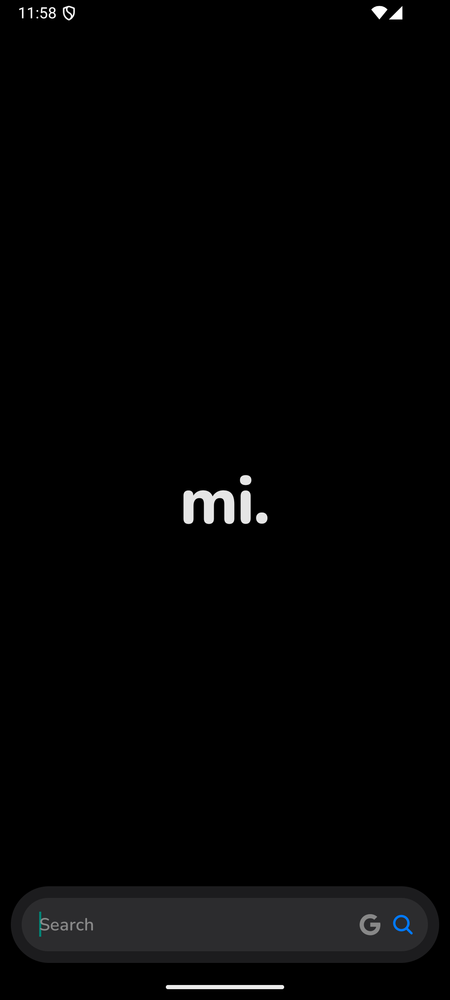
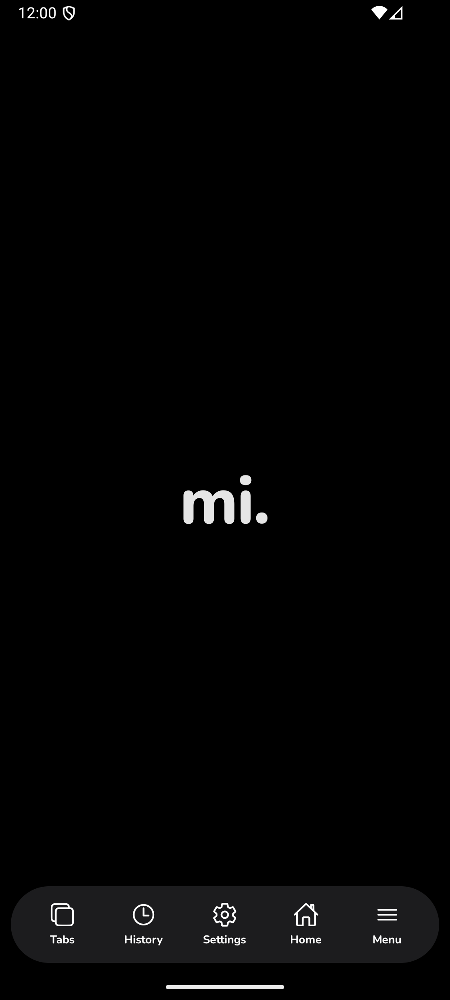
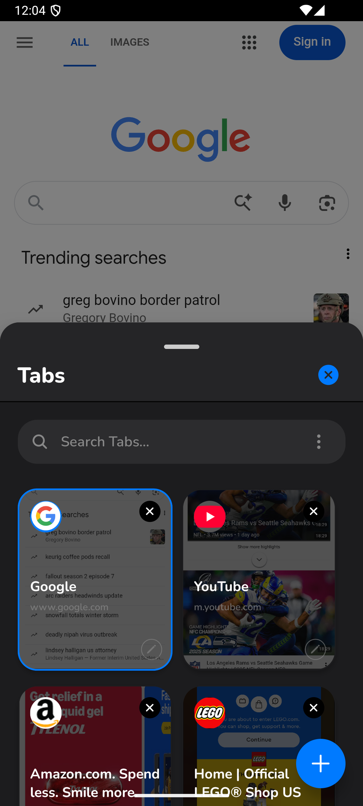
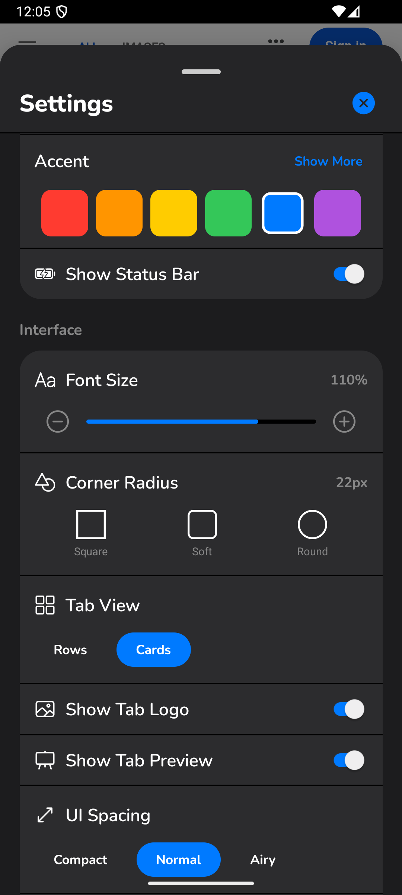

# Developer Guide 🛠️

This document outlines the technical architecture and development setup for **mi. Browser**.

## 🖼️ UI Reference

To understand the component structure, refer to these current UI states:

<p align="center">
  
  
  
  
</p>

## 📱 Tech Stack

- **Core Framework:** React Native, Expo (SDK 52+)
- **Routing:** Expo Router (File-based routing)
- **Web Engine:** `react-native-webview` - The core component rendering web content.
- **State Management:** React Hooks (`useState`, `useReducer`, `useContext`) combined with `AsyncStorage` for persistence.
- **Animations:**
  - `react-native-reanimated` for high-performance UI interactions.
  - Native Driver `Animated` for simple transitions.
- **Gestures:** `react-native-gesture-handler` and React Native's `PanResponder` for the custom "Pill" interface.
- **System Integration:**
  - `expo-quick-actions` (Home screen shortcuts)
  - `expo-file-system` (Caching, image downloads)
  - `expo-haptics` (Tactile feedback)
  - `expo-print` (Printing support)

## 📂 Project Structure

```
/
├── app/                 # Expo Router pages (UI screens)
├── assets/              # Static assets (images, fonts)
├── src/
│   ├── components/      # Reusable UI components (Tabs, History, Settings)
│   ├── hooks/           # Custom hooks (logic extraction)
│   ├── utils/           # Helper functions
│   └── constants.ts     # App-wide configuration
└── ...config files
```

## 📥 Development Setup

### Prerequisites

- **Node.js** (LTS version recommended)
- **npm** or **yarn**
- **Expo CLI**: Install globally via `npm install -g expo-cli` (optional, can use `npx`).
- **Mobile Device** with **Expo Go** app installed, or an **Android Emulator**.

### Installation

1.  **Clone the repository**

    ```bash
    git clone https://github.com/yourusername/mi-browser.git
    cd mi-browser
    
    ```

2.  **Install dependencies**
    ```bash
    npm install
    # or
    yarn install
    ```

### Running the App

1.  **Start the development server**

    ```bash
    npx expo start
    ```

2.  **Run on Device/Emulator**
    - **Physical Device:** Open the **Expo Go** app on your phone and scan the QR code displayed in the terminal.
    - **Android Emulator:** Press `a` in the terminal window.

### Building

To build a standalone APK or IPA, refer to the [Expo Build Documentation](https://docs.expo.dev/build/introduction/).

```bash
# Example for Android APK (local build if configured, or EAS)
eas build -p android --profile preview
```
