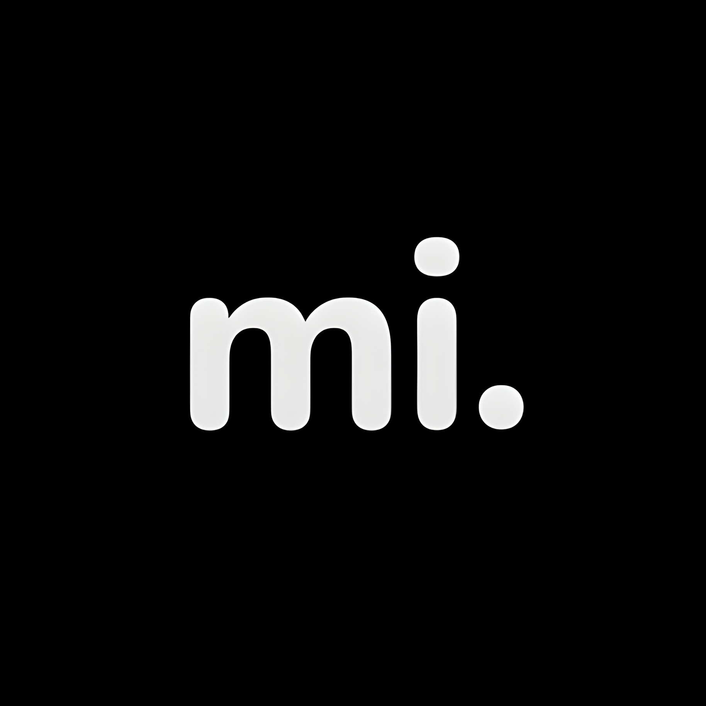
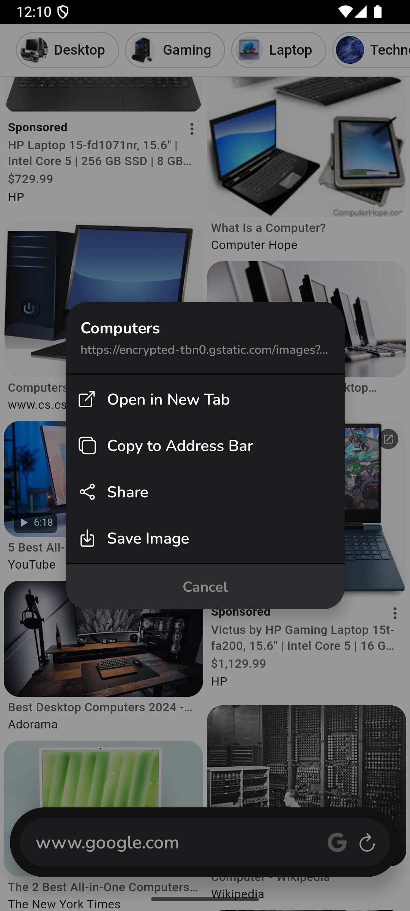

#  mi. Browser

**mi.** (pronounced "my") is a hyper-lightweight, distraction-free mobile browser designed for the modern web. It rethinks the mobile browsing experience by replacing the traditional toolbar with a single, intelligent "Pill" interface. 

Designed for simplicity and speed, **mi.** strips away the complexity of traditional mobile browsers to focus on what matters most: your content. It is fast, private, and deeply customizable to fit your specific browsing style.

 

---

## 🔮 The "Pill" Interface

The core of **mi.** is the floating Pill at the bottom of the screen—a unified control center for your entire browsing experience.

*   **Tap** — Focus search or enter a URL.
*   **Swipe Up** — Access your Dashboard (Tabs, History, Bookmarks, and Settings).
*   **Swipe Down** — Hide the interface for a fully immersive, 100% content view.
*   **Swipe Left/Right** — Quickly navigate backward or forward through your history.

The interface is optimized for one-handed use, keeping all critical controls comfortably within your thumb's reach.

 

---

## 🚀 Smart Search & Navigation

*   **Unified Search Bar:** Search the web or enter URLs directly. Supports custom search engines (Google, DuckDuckGo, Bing, Brave, Startpage).
*   **Quick Actions:** Long-press the app icon on your home screen to instantly launch into **QR Scan** mode.
*   **Visual Tab Management:** Manage open tabs with a beautiful grid view, complete with visual snapshots of your browsing sessions.
*   **Recent Searches:** A swipeable drawer in the search view gives you instant access to your recent queries.

 

---

## 🎨 Deep Customization

*   **Adaptive Theming:** The UI adapts to your preferences. Choose your **Accent Color** and watch the interface harmonize.
*   **Shape Shifting:** Customize the UI geometry. Go from **Square** to **Round** (and everything in between) with the corner radius slider.
*   **Density Control:** Adjust the **Pill Height** and **UI Padding** to fit your thumb's reach and your screen's size.
*   **Reader Mode:** Strip away clutter from articles for a clean, focused reading experience.

 

---

## 🛠️ Power Tools & Security

*   **QR Toolbox:** Built-in **QR Scanner** to open links instantly and a **QR Generator** to share your current page.
*   **Desktop Mode:** Request the desktop version of sites easily.
*   **Privacy First:** Toggle cookie blocking and force **HTTPS Only** connections.
*   **History Management:** Swipe to delete individual items or wipe data by time range (Last Hour, 24 Hours, All Time).

 

---

## 📥 Download & Installation

We provide a direct APK download for Android users.

1.  Go to the **[Releases Page](https://github.com/yourusername/my-browser/releases)** on this repository.
2.  Download the latest `.apk` file (e.g., `mi-browser-v1.0.0.apk`).
3.  Open the file on your Android device and confirm installation.

## 🧑‍💻 For Developers

Interested in the code or want to contribute? Check out our **[Developer Guide](DEVELOPMENT.md)** for technical details, tech stack info, and instructions on how to run the project locally with Expo.

---

  <em>A minimal masterpiece for the modern web.</em>

